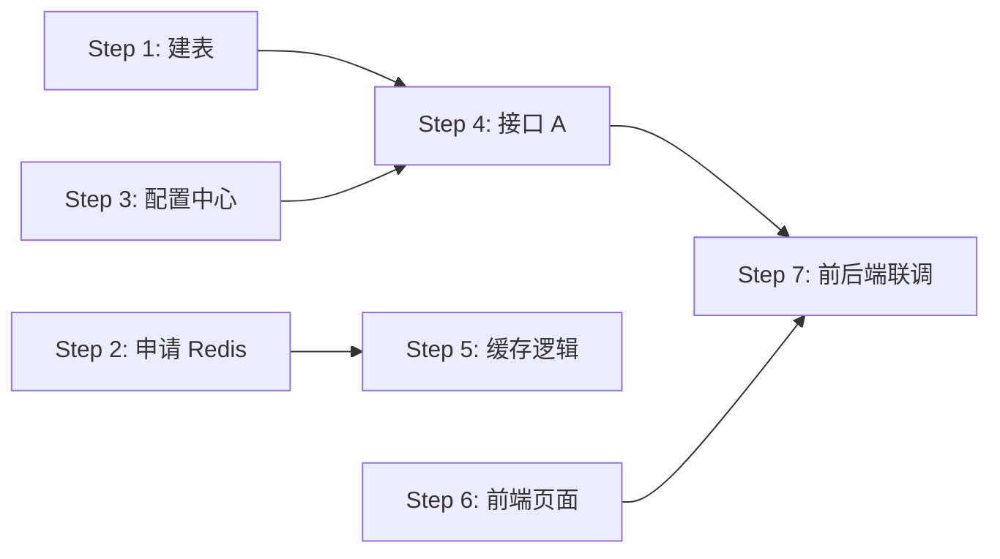

# {迭代主题} — 编码实施计划

- 创建时间：yyyy-MM-dd
- 基于：技术方案/、评估方案_DOC.md、工时评估_DOC.md
- 状态：{草稿 / 已对齐 / 执行中 / 已完成}

[TOC]

## 一、计划概述

| 维度 | 内容 |
|------|------|
| **迭代主题** | |
| **涉及应用** | {列出所有涉及的应用/仓库} |
| **参与人员** | {张三（后端）、李四（前端）、...} |
| **计划编码周期** | yyyy-MM-dd ~ yyyy-MM-dd |
| **计划联调周期** | yyyy-MM-dd ~ yyyy-MM-dd |
| **计划提测时间** | yyyy-MM-dd |

## 二、依赖关系总览

> 用 Mermaid 画出步骤之间的依赖关系，一目了然。



## 三、基础设施步骤

> 编码之前必须完成的准备工作，从工时评估的「基础设施与准备工作」中搬过来。

| Step | 内容 | 责任人 | 预计工时 | 前置依赖 | 验证方式 | 状态 | 备注 |
|------|------|--------|---------|---------|---------|------|------|
| 1 | {建库建表} | | | 无 | {连接数据库验证表结构} | 待开始 | |
| 2 | {申请 Redis} | | | 无 | {连接验证读写} | 待开始 | |
| 3 | {配置中心初始化} | | | 无 | {配置生效验证} | 待开始 | |
| 4 | {申请 MQ topic} | | | 无 | {消息收发验证} | 待开始 | |
| ... | | | | | | | |

**基础设施验证节点：** 所有基础设施步骤完成后，统一验证一次，确认所有资源可用。

## 四、编码步骤明细

### 场景 1：{场景名称}

**后端开发：**

| Step | 开发内容 | 涉及接口/表/缓存 | 涉及文件（预估） | 责任人 | 预计工时 | 前置依赖 | 验证方式 | 产出物 | 状态 |
|------|---------|----------------|----------------|--------|---------|---------|---------|--------|------|
| 5 | {新建 xxx 接口} | `POST /api/xxx` | `XxxController.java` `XxxService.java` | 张三 | 4h | Step 1 | {Postman 调通} | {接口可调用} | 待开始 |
| 6 | {xxx 缓存逻辑} | `cache:xxx:{id}` | `XxxCacheManager.java` | 张三 | 2h | Step 2, 5 | {缓存命中验证} | {缓存读写正常} | 待开始 |
| ... | | | | | | | | | |

**前端开发：**

| Step | 开发内容 | 涉及页面/组件 | 涉及文件（预估） | 责任人 | 预计工时 | 前置依赖 | 验证方式 | 产出物 | 状态 |
|------|---------|-------------|----------------|--------|---------|---------|---------|--------|------|
| 7 | {xxx 页面开发} | {列表页} | | 李四 | 8h | 无 | {页面渲染正常} | {页面可访问} | 待开始 |
| ... | | | | | | | | | |

**开发后台：**

| Step | 开发内容 | 涉及页面/接口 | 责任人 | 预计工时 | 前置依赖 | 验证方式 | 状态 |
|------|---------|-------------|--------|---------|---------|---------|------|
| 8 | {管理页面} | | | | | | 待开始 |
| ... | | | | | | | |

**场景 1 联调：**

| Step | 联调内容 | 参与人 | 前置依赖 | 预计工时 | 验证方式 | 状态 |
|------|---------|--------|---------|---------|---------|------|
| 9 | {前后端联调} | 张三 + 李四 | Step 5, 7 | | {全链路跑通} | 待开始 |
| ... | | | | | | |

### 场景 2：{场景名称}

> 同上结构，按场景逐个展开...

### 公共/横切步骤

| Step | 开发内容 | 说明 | 责任人 | 预计工时 | 前置依赖 | 验证方式 | 状态 |
|------|---------|------|--------|---------|---------|---------|------|
| N | {监控接入} | {接口监控 + Grafana 看板} | | | {核心接口开发完成} | {看板数据正常} | 待开始 |
| N+1 | {埋点实现} | {前端 + 后端埋点} | | | {页面 + 接口开发完成} | {埋点数据上报验证} | 待开始 |
| N+2 | {日志打点} | {关键链路日志} | | | {核心接口开发完成} | {日志可查询} | 待开始 |
| N+3 | {限流配置} | {核心接口限流} | | | {接口开发完成} | {限流生效验证} | 待开始 |
| ... | | | | | | | |

## 五、验证节点（Checkpoint）

| 节点 | 验证内容 | 涉及 Step | 验证标准 | 预计时间 | 责任人 | 状态 |
|------|---------|----------|---------|---------|--------|------|
| CP1 | 基础设施就绪 | Step 1-4 | 所有资源可用、连通性验证通过 | | | |
| CP2 | 核心链路跑通 | Step 5-6 | MVP 场景端到端跑通 | | | |
| CP3 | 前后端联调通过 | Step 9 | 前端调后端接口全部通过 | | | |
| CP4 | 全场景验证 | 全部 Step | 所有场景自测通过 | | | |
| CP5 | 提测就绪 | 全部 | 代码合入、环境部署、提测文档就绪 | | | |

## 六、并行任务视图

> 按时间线展示哪些任务可以并行，方便多人协作。

```
时间线 →

张三: [Step 1 建表][Step 2 Redis][Step 5 接口A ][Step 6 缓存  ][Step 9 联调   ]
李四:                              [Step 7 前端页面A           ][Step 9 联调   ]
王五:              [Step 3 配置  ] [Step 8 后台页面             ]
```

## 七、风险与应对

| 风险 | 影响步骤 | 应对方案 | 负责人 |
|------|---------|---------|--------|
| {资源申请延迟} | Step 1-4 | {提前申请，阻塞时先做不依赖资源的步骤} | |
| {对方接口未就绪} | Step N | {先用 Mock，约好联调时间窗口} | |
| {技术方案偏差} | — | {小偏差记录后继续，大偏差回 system-design 重新评估} | |

## 八、方案偏差记录

> 编码过程中发现和技术方案不一致的地方，记录在这里，编码完成后统一同步回技术方案。

| 偏差项 | 技术方案原设计 | 实际实现 | 偏差原因 | 影响范围 | 是否需要更新技术方案 |
|--------|-------------|---------|---------|---------|-------------------|
| | | | | | |

## 九、每日进度（可选）

> 如果需要跟踪每日进度，按日期记录。

### yyyy-MM-dd

- 完成：Step X、Step Y
- 进行中：Step Z
- 阻塞：{描述阻塞原因}
- 明日计划：Step A、Step B
