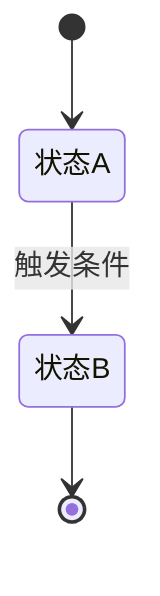

# {迭代主题} — 需求拆解

- 创建时间：yyyy-MM-dd
- 基于：原始需求_DOC.md
- 拆解视角：**用户视角**（每个场景从用户出发，讲清楚用户做什么、看到什么、得到什么）

[TOC]

## 一、需求概述

> 一句话：{谁} 在 {什么场景} 下可以 {做什么}，从而 {达到什么效果}。

### 需求分类

| 维度 | 分类 | 说明 |
|------|------|------|
| **需求来源** | 产品需求 / Bug修复 / 技术需求 / 运营需求 / 测试反馈 / 用户反馈 / 其他 | {具体说明} |
| **需求规模** | 大需求（>5人日） / 中需求（2-5人日） / 小需求（<2人日） | 粗估，详细见工时评估 |
| **紧急程度** | 🔴 紧急修复 / 🟡 计划迭代 / ⚪ 长期优化 | {理由} |
| **提出方** | 产品 / 开发 / 测试 / 运营 / 用户 / 领导 / 其他 | {具体人员或渠道} |
| **影响范围** | 单端 / 多端 / 跨系统 / 全渠道 | {涉及哪些端/系统/渠道} |

**分类说明**：

- **需求来源**：
    - *产品需求*：来自 PRD、原型、产品规划
    - *Bug修复*：线上缺陷、功能异常、体验问题
    - *技术需求*：架构升级、重构、技术债偿还、性能优化
    - *运营需求*：活动配置、数据统计、运营工具
    - *测试反馈*：测试阶段发现的问题或优化建议
    - *用户反馈*：客诉、用户建议、体验反馈

- **需求规模**：
    - *大需求*：跨系统、多模块、需要多人协作、>5 人日
    - *中需求*：单系统内改动、2-5 人日
    - *小需求*：局部改动、配置调整、<2 人日

- **紧急程度**：
    - 🔴 *紧急修复*：线上故障、安全漏洞、严重 Bug，需立即处理
    - 🟡 *计划迭代*：按版本规划，正常排期
    - ⚪ *长期优化*：体验改进、技术债，可延后

- **影响范围**：
    - *单端*：仅 App / 小程序 / H5 / PC 中的一个
    - *多端*：需要多个端同步改动
    - *跨系统*：涉及多个后端系统联动
    - *全渠道*：所有渠道都需要支持（参考渠道清单）

## 二、真伪需求判断

> **在投入任何分析精力之前，先回答这个问题：这是真实需求还是伪需求？**
> 伪需求做了白费，真需求没识别出来会漏掉关键价值。

### 2.1 需求真实性验证

对每个功能点/子需求，逐一过以下问题：

| 功能点 | 验证问题 | 结论 |
|--------|---------|------|
| {功能点} | **谁真的在用/会用？** 有没有实际用户？还是"我们觉得用户需要"？ | 真实 / 存疑 / 伪需求 |
| | **有没有数据支撑？** 用户反馈、使用数据、投诉记录、竞品验证？ | |
| | **不做会怎样？** 用户会流失？体验变差？业务受阻？还是根本没人在意？ | |
| | **有没有更简单的替代方案？** 是否可以通过配置、运营手段、已有功能解决？ | |
| | **谁在推这个需求？** 是用户真实痛点，还是内部 KPI 驱动？ | |

### 2.2 伪需求识别信号

> 出现以下信号时要高度警惕，主动和需求方确认：

- 🚩 "用户应该会需要" — 没有数据支撑的假设
- 🚩 "竞品有我们也要有" — 没有分析是否适合自己的用户
- 🚩 "领导说要做" — 没有回到用户价值验证
- 🚩 "顺便加上吧" — 没有经过独立的价值判断
- 🚩 需求描述全是"系统要做什么"而不是"用户要什么" — 视角错了
- 🚩 找不到具体的目标用户或使用场景 — 需求可能是空中楼阁

### 2.3 判断结论

| 功能点 | 判断 | 理由 | 处理建议 |
|--------|------|------|---------|
| | ✅ 真实需求 | | 继续拆解 |
| | ⚠️ 存疑 | | 需补充数据/和需求方确认后再拆 |
| | ❌ 伪需求 | | 建议砍掉，理由：{} |

> **只有判断为"真实需求"的功能点才进入后续拆解。存疑的先挂起，伪需求直接标注并建议砍掉。**

## 三、价值评估

> **真实需求也要算清楚值不值得做**。投入多少、回报多少、不做会怎样，搞明白再动手。

### 3.1 业务价值

| 价值维度 | 预期收益 | 衡量指标 | 当前基线 | 预期目标 |
|---------|---------|---------|---------|---------|
| 用户增长 | | {DAU / 新增用户 / 激活率} | | |
| 用户留存 | | {次日留存 / 7 日留存 / 回访率} | | |
| 转化提升 | | {转化率 / GMV / 客单价} | | |
| 效率提升 | | {操作步骤减少 / 处理时长降低} | | |
| 成本降低 | | {人力成本 / 运维成本 / 资源成本} | | |
| 风险规避 | | {故障率 / 投诉率 / 合规风险} | | |

> 填不满没关系，但至少要有 1-2 个维度能说清楚。如果一个都说不出来，回头看看是不是伪需求。

### 3.2 投入产出比（ROI）

| 项目 | 估算 |
|------|------|
| **预计投入** | {X 人日开发 + Y 人日测试 + Z 人日联调}（粗估，详细见工时评估） |
| **预期回报** | {具体指标提升 / 用户体验改善 / 成本节省} |
| **回报周期** | {上线后多久能看到效果} |
| **不做的代价** | {用户流失？体验差？业务受阻？竞争力下降？还是没影响？} |

### 3.3 价值结论

> 一句话总结：这个需求值不值得做？投入产出是否合理？

- 结论：{值得投入 / 收益不明确需补数据 / ROI 低建议降级或砍掉}
- 建议：{}

## 四、系统现状分析

> **这一步必须先做**。不管是全新需求还是老系统改造，都要先搞清楚"现在是什么样"，再谈"要变成什么样"。

### 4.1 当前系统现状

| 维度 | 现状说明 |
|------|---------|
| **是否已有相关功能** | {全新 / 在已有功能上调整 / 替换旧方案} |
| **现有用户流程** | {用户当前怎么完成这件事？如果是新需求写"无"} |
| **涉及的现有模块/服务** | {列出已有的相关模块、接口、页面} |
| **现有数据模型** | {相关的表、字段、数据流} |
| **已知问题/技术债** | {现有方案的痛点、历史遗留问题} |

### 4.2 现状 → 目标 变化对比

| 维度 | 现状（As-Is） | 目标（To-Be） | 变化点 |
|------|-------------|-------------|--------|
| 用户流程 | | | |
| 数据流 | | | |
| 涉及模块 | | | |
| 权限/角色 | | | |

### 4.3 影响范围预判

> 基于现状分析，这个需求会影响哪些已有功能？是否有连带改动？

- 直接影响：{本次需求直接改动的部分}
- 间接影响：{因为改动可能连带受影响的功能}
- 不影响：{明确不受影响的部分，避免过度担忧}

## 五、逻辑闭环校验

> **核心问题：这个需求从用户视角走一遍，每个环节都能串起来吗？有没有断点？**

### 5.1 用户全链路走查

> 从用户进入到最终完成，标注每一步。如果某步存在断点或不确定，用 ❓ 标注。

### 5.2 闭环检查清单

| 检查项 | 是否闭环 | 说明 |
|--------|---------|------|
| 用户从哪里进入这个功能？入口明确吗？ | ✅ / ❌ | |
| 操作完成后用户去哪？有没有死胡同？ | ✅ / ❌ | |
| 异常情况下用户能恢复到正常流程吗？ | ✅ / ❌ | |
| 涉及多角色时，每个角色的流程都走通了吗？ | ✅ / ❌ | |
| 和现有功能的衔接点是否清楚？ | ✅ / ❌ | |
| 数据从产生到消费的链路完整吗？ | ✅ / ❌ | |

### 5.3 发现的断点 / 逻辑漏洞

> 如果有未闭环的点，在这里列出，标注是需求层面的问题还是实现层面可以兜底。

| 编号 | 断点描述 | 类型 | 建议处理方式 |
|------|---------|------|-------------|
| G1 | | 需求缺失 / 逻辑冲突 / 边界不清 | |

## 六、场景拆解

### 场景 1：{场景名称}

| 维度 | 说明 |
|------|------|
| **用户角色** | |
| **前置条件** | |
| **用户操作** | |
| **系统响应** | |
| **成功结果** | |
| **异常情况** | |

**用户故事**：作为 {角色}，我希望 {操作}，以便 {目的}。

**验收标准**（Given-When-Then）：

- Given：{前置条件}
- When：{用户操作}
- Then：{期望结果}

### 场景 2：{场景名称}

| 维度 | 说明 |
|------|------|
| **用户角色** | |
| **前置条件** | |
| **用户操作** | |
| **系统响应** | |
| **成功结果** | |
| **异常情况** | |

> 按需继续添加场景...

## 七、场景优先级排序

> **拆完场景后必须排优先级**。资源有限，不是所有场景都要做、都要现在做。

### 6.1 优先级分类

| 场景 | 优先级 | 分类依据 |
|------|--------|---------|
| {场景名} | 🔴 **必须做**（Must Have） | {理由：核心链路 / 不做无法上线 / 用户强诉求} |
| {场景名} | 🟡 **可以做**（Should Have） | {理由：体验提升 / 有价值但不阻塞核心流程} |
| {场景名} | ⚪ **暂不做**（Won't Have） | {理由：优先级低 / ROI 不高 / 可后续迭代} |

### 6.2 分类标准

**🔴 必须做（Must Have）**：
- 不做这个功能，整个需求无法交付或无法形成最小闭环
- 用户核心路径上的关键环节
- 有明确的数据/业务指标压力

**🟡 可以做（Should Have）**：
- 做了体验更好，但不做不影响核心功能
- 有价值但实现成本和收益需要权衡
- 可以作为快速跟进的下一版本内容

**⚪ 暂不做（Won't Have）**：
- 当前优先级低，不影响本次迭代目标
- ROI 不高，投入产出比不划算
- 需求存疑或依赖未定，不适合现在做

### 6.3 最小可交付范围（MVP）

> 只做"必须做"的场景，能否形成一个完整、可用的最小闭环？

- MVP 包含的场景：{列出}
- MVP 能满足的用户价值：{一句话}
- MVP 之后的迭代计划：{可以做的场景排入哪个版本}

## 八、状态与规则

### 状态流转（如有）

### 业务规则清单

| 编号 | 规则描述 | 条件 | 结果 |
|------|---------|------|------|
| R1 | | | |
| R2 | | | |

## 九、边界与异常

| 场景 | 异常情况 | 用户看到什么 | 处理方式 |
|------|---------|-------------|---------|
| | | | |

## 十、隐藏需求排查

> **产品只关注功能，下面这些他们大概率不会提，但上线后缺一个就可能翻车。强制过一遍。**

### 10.1 外部依赖与对外能力

| 检查项 | 情况 | 详细说明 |
|--------|------|---------|
| **依赖外部系统/接口吗？** | 是 / 否 | {依赖谁？SLA 多少？挂了怎么办？需要提前联调吗？} |
| **需要给其他系统提供能力吗？** | 是 / 否 | {谁会调？接口契约谁定？文档谁写？} |
| **有第三方数据/服务吗？** | 是 / 否 | {费用？配额？限流？授权周期？} |

### 10.2 合规与安全

| 检查项 | 情况 | 详细说明 |
|--------|------|---------|
| **涉及用户隐私数据吗？** | 是 / 否 | {手机号/身份证/位置/行为数据？隐私保护策略？} |
| **有合规/法规要求吗？** | 是 / 否 | {GDPR/个保法/等保/行业规范？} |
| **需要安全评审吗？** | 是 / 否 | {接口鉴权/权限控制/防刷/注入防护？} |
| **涉及资金/支付吗？** | 是 / 否 | {对账/退款/精度/幂等？} |

### 10.3 性能与流量

| 检查项 | 情况 | 详细说明 |
|--------|------|---------|
| **预期流量多大？** | | {日均 PV/UV、峰值 QPS、数据增量} |
| **有性能要求吗？** | 是 / 否 | {响应时间上限？吞吐量要求？} |
| **需要扛突发流量吗？** | 是 / 否 | {活动/推送/热点事件导致的尖峰？} |
| **需要限流/熔断吗？** | 是 / 否 | {哪些接口需要？阈值多少？} |

### 10.4 埋点、统计与监控

| 检查项 | 情况 | 详细说明 |
|--------|------|---------|
| **需要埋点吗？** | 是 / 否 | {哪些关键行为需要埋？前端/后端？事件名？} |
| **需要流量统计吗？** | 是 / 否 | {PV/UV/转化漏斗？用什么平台看？} |
| **需要在线状态监控吗？** | 是 / 否 | {功能上线后怎么知道在正常运行？看什么指标？} |
| **需要业务告警吗？** | 是 / 否 | {什么情况告警？告给谁？阈值多少？} |
| **产品要看数据报表吗？** | 是 / 否 | {看什么数据？实时还是 T+1？谁来建？} |

### 10.5 上线保障与运维

| 检查项 | 情况 | 详细说明 |
|--------|------|---------|
| **需要灰度发布吗？** | 是 / 否 | {灰度策略？按用户/渠道/比例？} |
| **有回滚方案吗？** | 是 / 否 | {出问题了怎么回退？数据怎么办？} |
| **需要功能开关吗？** | 是 / 否 | {配置化开关？紧急关闭能力？} |
| **需要降级方案吗？** | 是 / 否 | {依赖挂了展示什么？用户体验兜底？} |
| **需要数据迁移吗？** | 是 / 否 | {老数据怎么处理？迁移脚本谁写？} |
| **多端/多渠道一致吗？** | 是 / 否 | {App/小程序/H5/PC 都要做吗？哪些不做？} |

### 10.6 隐藏需求汇总

> 上面排查出来的每一项"是"都是一个隐藏需求，汇总到这里，标注谁负责跟进。

| 编号 | 隐藏需求 | 来源（哪个检查项） | 负责人 | 是否纳入本次迭代 |
|------|---------|------------------|--------|----------------|
| H1 | | | | 是 / 否，下个版本做 |

## 十一、范围边界

### 本次做

- {必须做的最小闭环}

### 本次不做

- {明确排除的内容，避免 scope creep}

## 十二、测试用例清单

> **功能测试用例，作为测试阶段的输入。每个验收标准对应一条测试用例。**

| 编号 | 场景 | Given | When | Then | 优先级 |
|------|------|-------|------|------|--------|
| TC01 | {场景名称} | {前置条件} | {操作} | {期望结果} | P0 |
| TC02 | {场景名称} | {前置条件} | {操作} | {期望结果} | P0 |
| TC03 | {场景名称} | {前置条件} | {操作} | {期望结果} | P1 |

**优先级定义：**
- P0：核心功能，必须通过才能上线
- P1：重要功能，应该通过
- P2：边界场景，可以做

## 十三、待产品确认 & 未决问题

> **所有模糊的、含糊的、"应该是吧"的地方，全部列出来和产品确认清楚，确认结果写死在这里。不确认就不动手。**

### 12.1 强制确认清单

> 以下是产品容易含糊或遗漏的点，逐条过一遍，确认后填入结论。

| 编号 | 确认项 | 产品回复 | 确认人 | 确认日期 |
|------|--------|---------|--------|---------|
| C1 | 支持哪些客户端？（App/小程序/H5/PC）哪些不做？ | | | |
| C2 | 支持哪些渠道？（参考渠道清单）哪些不做？ | | | |
| C3 | 文案/提示语/错误提示具体是什么？ | | | |
| C4 | 各端交互是否一致？有差异的话分别是什么？ | | | |
| C5 | 涉及的数据展示口径是什么？（排序/筛选/默认值） | | | |
| C6 | 权限怎么控？哪些角色能看/能操作？ | | | |
| C7 | 老用户/老数据怎么处理？需要兼容吗？ | | | |
| C8 | 有没有运营配置需求？（开关/文案/排序可配？） | | | |
| C9 | 异常情况给用户展示什么？（空状态/加载失败/无权限） | | | |
| C10 | 有没有时间限制？（活动有效期/功能下线时间） | | | |

> 以上只是常见项，**需求中任何你觉得不够明确的点，都加到下面的未决问题表里**。

### 12.2 未决问题

| 编号 | 问题 | 需要谁确认 | 当前假设 | 确认结果 | 确认日期 |
|------|------|-----------|---------|---------|---------|
| Q1 | | | | | |

---

## 十四、自动化检查结果

> **以下检查由 AI 自动执行，有问题才告警。**

### 检查清单

| # | 检查项 | 状态 | 说明 |
|---|--------|------|------|
| 1 | 需求拆解文档完整 | ✅ / 🚨 | |
| 2 | 伪需求判断完成 | ✅ / 🚨 | |
| 3 | 价值评估明确 | ✅ / 🚨 | |
| 4 | 场景优先级已排定 | ✅ / 🚨 | |
| 5 | MVP 范围明确 | ✅ / 🚨 | |
| 6 | 待确认项已确认 | ✅ / 🚨 | |

### 自动进入下一阶段

- [ ] ✅ 全部通过 → 自动进入 system-design
- [ ] 🚨 有问题 → 告警，等待人处理

