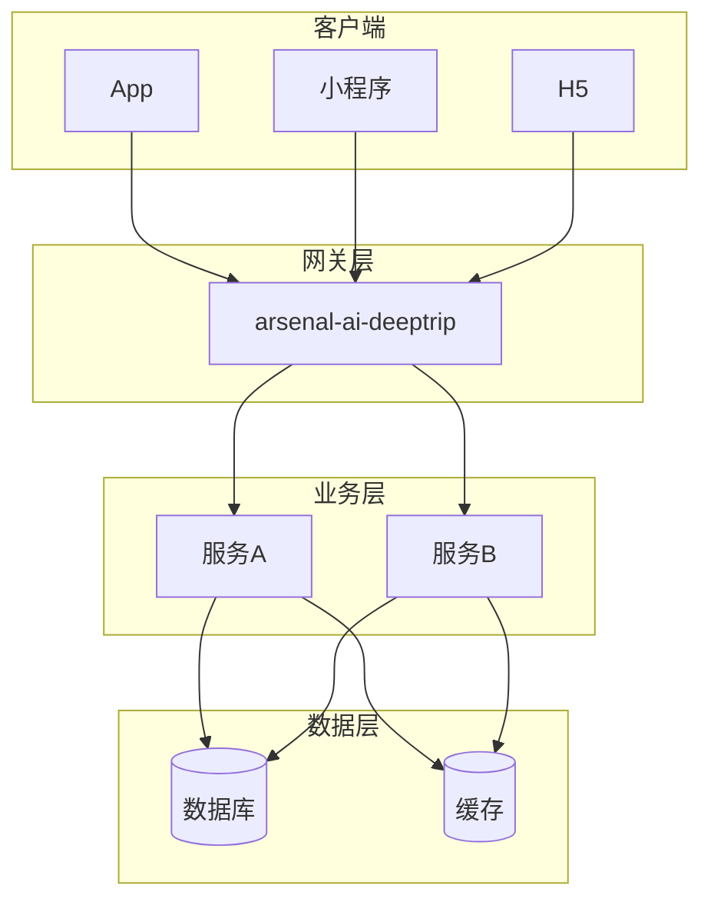
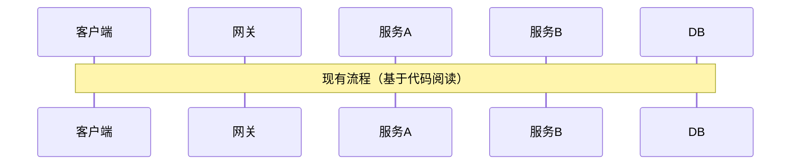
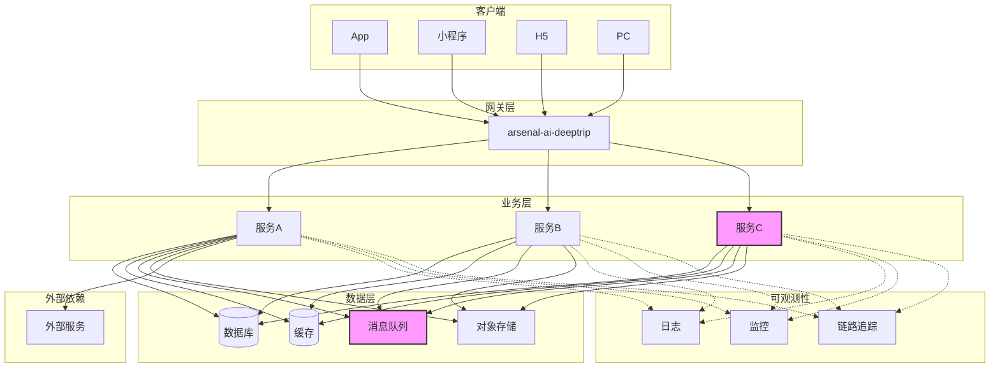
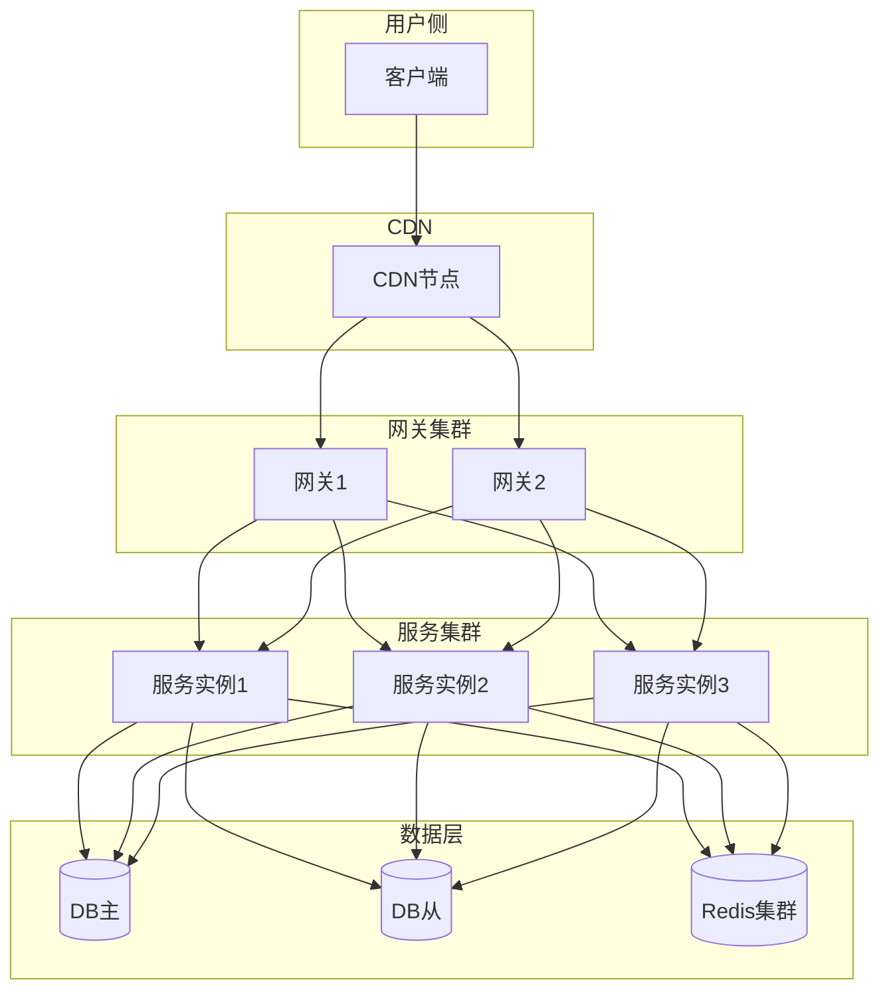

# {迭代主题} — 整体架构设计

- 创建时间：yyyy-MM-dd
- 状态：{草稿 / 评审中 / 已定稿}

[TOC]

## 一、架构目标

> 本次架构设计要解决的核心问题是什么？

- 核心问题：
- 目标状态：
- 约束条件（时间/资源/技术栈/兼容性）：

## 二、现有架构（先读代码再画图）

> **不读代码就设计架构 = 空中楼阁。必须先搞清楚现在怎么跑的。**

### 2.1 现有服务拓扑

### 2.2 现有调用链路

> 读代码后画出核心链路，标注关键类/方法。

### 2.3 现有问题与技术债

| 问题 | 影响 | 本次是否处理 | 处理方式 |
|------|------|-------------|---------|
| | | 是 / 留后续 | |

## 三、目标架构

### 3.1 服务拓扑（本次改动后）

> 画出新架构的全貌，新增/修改的服务/组件用不同颜色标注。

### 3.2 架构分层

| 层级 | 服务/组件 | 职责 | 本次变更 |
|------|----------|------|---------|
| 客户端 | App/小程序/H5/PC | 用户交互 | {新增/修改/不变} |
| 网关层 | arsenal-ai-deeptrip | 流量转发、鉴权、限流 | |
| 业务层 | 服务A | | |
| 业务层 | 服务B | | |
| 数据层 | MySQL | | |
| 数据层 | Redis | | |
| 数据层 | Kafka | | |

### 3.3 服务间调用关系

| 调用方 | 被调方 | 协议 | 用途 | 本次变更 |
|--------|--------|------|------|---------|
| | | HTTP/RPC/MQ | | 新增/修改/不变 |

## 四、技术选型

### 4.1 新引入的技术/框架

| 技术/框架 | 用途 | 选型理由 | 风险 | 负责人 |
|----------|------|---------|------|--------|
| | | | | |

### 4.2 技术选型对比（如有多种方案）

| 维度 | 方案A | 方案B | 推荐 |
|------|-------|-------|------|
| 复杂度 | | | |
| 性能 | | | |
| 可维护性 | | | |
| 开发时间 | | | |
| 团队熟悉度 | | | |

**推荐方案**：方案 X，理由：

## 五、部署架构

### 5.1 部署拓扑

### 5.2 资源需求

| 资源 | 现有规格 | 本次需求 | 申请渠道 | 状态 |
|------|---------|---------|---------|------|
| 服务器 | | | | 待申请/已审批 |
| 数据库 | | | DBA审批 | |
| Redis | | | | |
| Kafka Topic | | | | |
| 域名/证书 | | | | |

## 六、依赖关系

### 6.1 内部依赖

| 依赖服务 | 用途 | SLA | 挂了的影响 | 降级方案 |
|---------|------|-----|-----------|---------|
| | | | | |

### 6.2 外部依赖

| 外部系统 | 用途 | SLA | 联调联系人 | 挂了的影响 | 降级方案 |
|---------|------|-----|-----------|-----------|---------|
| | | | | | |

### 6.3 联调方清单

| 联调方 | 联调内容 | 责任人 | 联系方式 |
|--------|---------|--------|---------|
| | | | |

## 七、容量规划

| 指标 | 当前值 | 预估峰值 | 需要扩容 | 扩容方案 |
|------|-------|---------|---------|---------|
| QPS | | | 是/否 | |
| 数据量 | | | | |
| 存储容量 | | | | |

## 八、风险与应对

| 风险 | 影响 | 概率 | 预防措施 | 应急方案 |
|------|------|------|---------|---------|
| | | 高/中/低 | | |

## 九、附录

### 9.1 相关文档

- [需求拆解_DOC.md](../需求拆解_DOC.md)
- [模块设计/](02_模块设计/)
- [数据流设计.md](03_数据流设计.md)

### 9.2 设计决策记录（ADR）

> 记录重要的设计决策及其背景，方便后续回顾。

| 日期 | 决策 | 背景 | 决策人 |
|------|------|------|--------|
| | | | |
