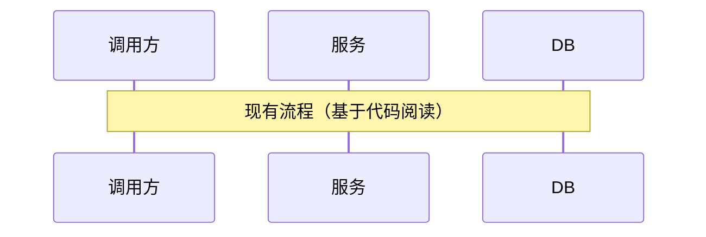
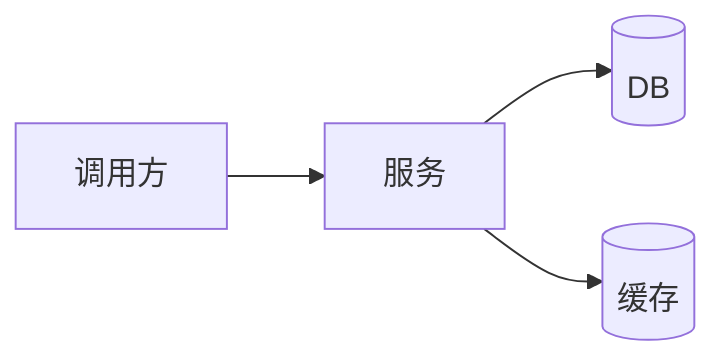
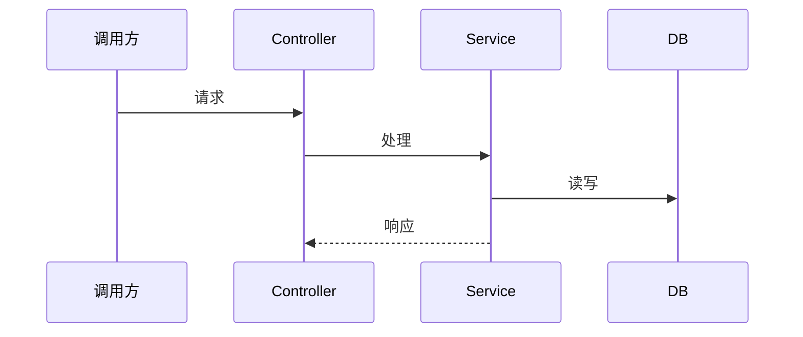

# {迭代主题} — 整体设计（简化版）

- 创建时间：yyyy-MM-dd
- 基于：需求拆解_DOC.md
- 状态：{草稿 / 评审中 / 已定稿}

[TOC]

> **简化版说明**：本迭代为小型迭代，将架构设计、模块设计、数据流设计、性能设计、安全设计合并为一份文档。

## 一、方案概述

> 一句话说清楚技术方案的核心思路。

- 需求来源：[需求拆解_DOC.md](../需求拆解_DOC.md)
- 核心目标：
- 约束条件：

## 二、现有系统分析（先读代码）

### 2.1 现有流程



### 2.2 现有问题

| 问题 | 影响 | 本次是否处理 |
|------|------|-------------|
| | | 是/否 |

## 三、目标架构

### 3.1 服务拓扑



### 3.2 变更范围

| 应用/模块 | 变更类型 | 责任人 |
|-----------|----------|--------|
| | 新增/修改 | |

## 四、模块设计

### 4.1 核心流程



### 4.2 关键类/方法

| 类名 | 职责 | 新增/修改 |
|------|------|----------|
| | | |

## 五、数据流设计

### 5.1 数据流向

```
请求 -> 校验 -> 处理 -> 存储 -> 响应
```

### 5.2 缓存设计（如有）

| Key | 内容 | 过期时间 |
|-----|------|---------|
| | | |

### 5.3 消息设计（如有）

| Topic | 生产者 | 消费者 |
|-------|--------|--------|
| | | |

## 六、接口设计

> 详细接口清单见 [接口清单.md](接口清单.md)

| 接口 | 方法 | 用途 | 新增/修改 |
|------|------|------|----------|
| | | | |

## 七、表设计

> 详细表设计见 [表设计.md](表设计.md)

| 表名 | 操作 | 说明 |
|------|------|------|
| | 新增/修改 | |

## 八、性能设计（如有性能要求）

| 指标 | 目标值 | 方案 |
|------|--------|------|
| 响应时间 P99 | ms | |
| QPS | | |

## 九、安全设计（如有敏感数据/对外接口）

### 9.1 认证鉴权

| 接口 | 鉴权规则 |
|------|---------|
| | |

### 9.2 敏感数据处理

| 数据 | 存储加密 |
|------|---------|---------|
| | | |

## 十、外部依赖（如有）

| 外部服务 | 用途 | 降级方案 |
|---------|------|---------|
| | | |

## 十一、上线方案

### 11.1 上线步骤

| 顺序 | 操作 | 负责人 |
|------|------|--------|
| 1 | 数据库变更 | |
| 2 | 服务发布 | |

### 11.2 回退方案

| 故障场景 | 回退操作 |
|---------|---------|
| | |

## 十二、待确认项

| 编号 | 问题 | 需要谁确认 | 确认结果 |
|------|------|-----------|---------|
| | | | |
