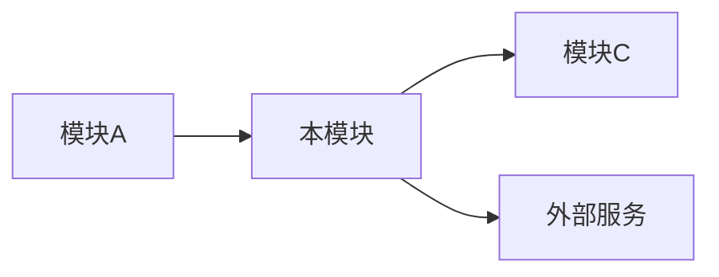
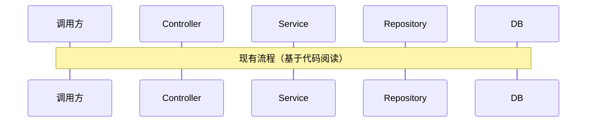
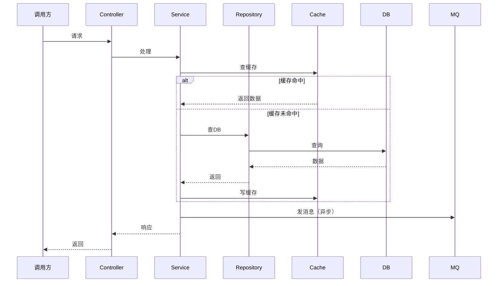
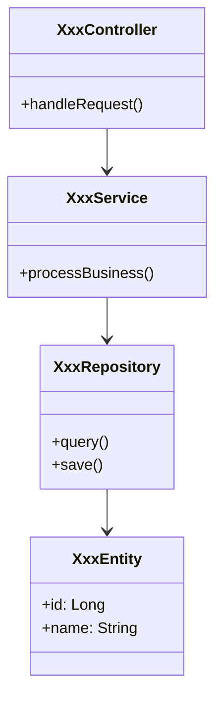

# {模块名称} — 模块设计

- 所属服务：
- 责任人：
- 创建时间：yyyy-MM-dd
- 状态：{草稿 / 评审中 / 已定稿}

[TOC]

## 一、模块概述

### 1.1 模块定位

> 这个模块在整个系统中的位置和职责是什么？

- 所属服务：
- 模块职责：
- 边界说明（管什么/不管什么）：

### 1.2 与其他模块的关系



| 关联模块/服务 | 关系 | 调用方式 | 说明 |
|--------------|------|---------|------|
| 上游：模块A | 被调用 | HTTP/RPC | 请求来源 |
| 下游：模块C | 调用 | HTTP/RPC | 数据提供方 |
| 下游：外部服务 | 调用 | HTTP | 外部依赖 |

## 二、现有实现（先读代码）

### 2.1 现有代码结构

```
模块目录/
├── controller/
├── service/
├── repository/
└── model/
```

### 2.2 现有核心类/方法

| 类名 | 职责 | 关键方法 | 问题/技术债 |
|------|------|---------|------------|
| | | | |

### 2.3 现有流程



## 三、设计目标

### 3.1 本次要解决的问题

| 问题 | 优先级 | 本次是否解决 |
|------|--------|-------------|
| | P0/P1/P2 | 是/否/后续 |

### 3.2 功能需求映射

| 需求场景 | 本模块职责 | 实现方式 |
|---------|-----------|---------|
| | | |

## 四、详细设计

### 4.1 核心流程



### 4.2 类设计



### 4.3 核心类/方法清单

| 类名 | 职责 | 新增/修改 | 关键方法 |
|------|------|----------|---------|
| XxxController | 接口入口 | 修改 | handleXxx() |
| XxxService | 业务逻辑 | 新增 | processXxx() |
| XxxRepository | 数据访问 | 修改 | queryXxx() |

## 五、接口设计

### 5.1 本模块提供的接口

| 接口 | 方法 | 用途 | 新增/修改 | 详细设计位置 |
|------|------|------|----------|-------------|
| /api/xxx | POST | | | [接口清单.md](../接口清单.md#接口名) |

### 5.2 本模块调用的接口

| 接口 | 所属服务/模块 | 用途 | 调用方式 |
|------|-------------|------|---------|
| | | | 同步/异步 |

## 六、数据设计

### 6.1 表设计

| 表名 | 操作 | 说明 |
|------|------|------|
| | 新增/修改/读/写 | |

> 详细字段设计见 [表设计.md](../表设计.md)

### 6.2 缓存设计

| 缓存 Key | 数据内容 | 过期时间 | 更新策略 | 一致性保证 |
|----------|---------|---------|---------|-----------|
| | | | 写时更新/定时刷新/失效重建 | |

### 6.3 消息设计

| Topic | 角色 | 用途 | 消息格式 |
|-------|------|------|---------|
| | 生产者/消费者 | | |

## 七、异常处理

### 7.1 异常分类

| 异常类型 | 场景 | 处理方式 | 用户提示 |
|---------|------|---------|---------|
| 参数校验失败 | | 返回 400 | |
| 业务异常 | | 返回业务错误码 | |
| 外部服务超时 | | 降级/重试 | |
| 数据库异常 | | 返回 500 | |

### 7.2 重试策略

| 场景 | 是否重试 | 重试次数 | 重试间隔 | 降级方案 |
|------|---------|---------|---------|---------|
| | 是/否 | | | |

## 八、并发与事务

### 8.1 并发场景

| 场景 | 并发风险 | 解决方案 |
|------|---------|---------|
| 同一用户重复提交 | 数据重复 | 幂等键去重 |
| 多用户操作同一资源 | 数据不一致 | 分布式锁/乐观锁 |

### 8.2 事务边界

| 操作 | 事务范围 | 隔离级别 | 失败处理 |
|------|---------|---------|---------|
| | 单事务/多事务 | | 回滚/补偿 |

## 九、配置项

| 配置 Key | 说明 | 默认值 | 是否支持动态修改 |
|----------|------|--------|----------------|
| | | | |

## 十、测试要点

### 10.1 单元测试

| 测试类 | 覆盖方法 | 测试场景 |
|--------|---------|---------|
| | | 正常流程、边界条件、异常场景 |

### 10.2 集成测试

| 测试场景 | 验证点 | 测试数据 |
|---------|--------|---------|
| | | |

## 十一、上线检查

- [ ] 代码已合并
- [ ] 单元测试通过
- [ ] 集成测试通过
- [ ] 配置项已配置
- [ ] 日志已埋点
- [ ] 监控已配置
- [ ] 文档已更新
