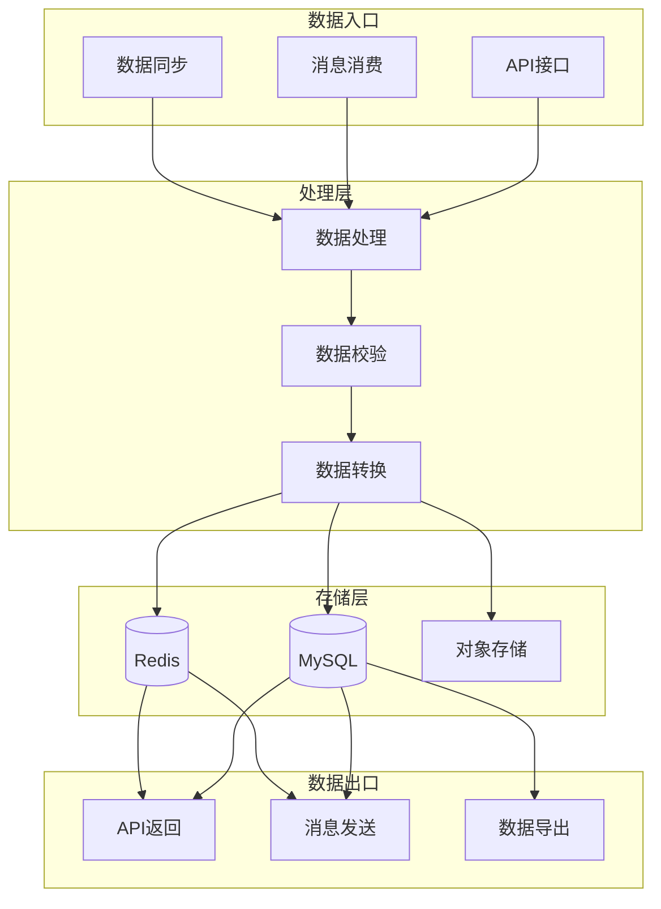
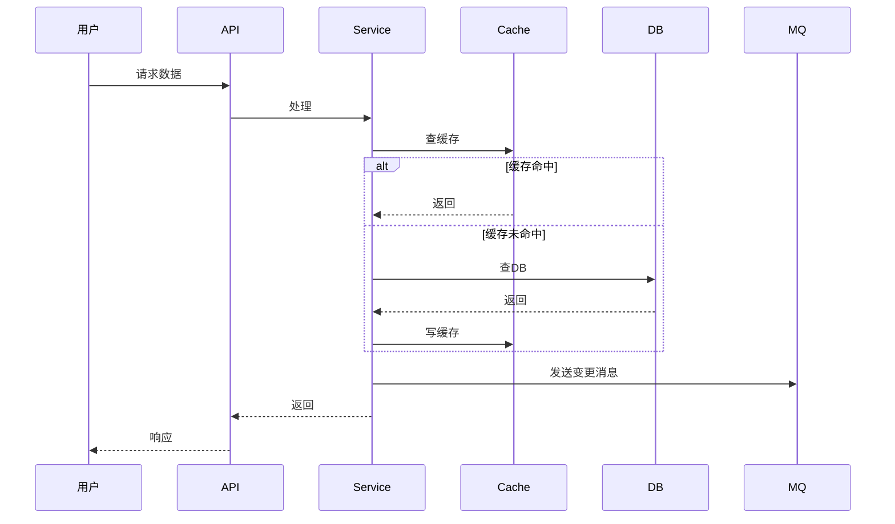

# {迭代主题} — 数据流设计

- 创建时间：yyyy-MM-dd
- 状态：{草稿 / 评审中 / 已定稿}

[TOC]

## 一、数据流概述

> 一句话说清楚数据怎么流转的。

## 二、数据流向图

### 2.1 整体数据流

### 2.2 核心数据流

> 最重要的业务数据是怎么流转的。

## 三、数据分类

### 3.1 数据分类总览

| 数据类型 | 数据内容 | 存储位置 | 读写特点 | 量级 |
|---------|---------|---------|---------|------|
| 业务主数据 | | MySQL | 读写频繁 | |
| 热点数据 | | Redis | 高频读取 | |
| 日志数据 | | ES/日志平台 | 只写少读 | |
| 文件数据 | | S3/OSS | 低频访问 | |

### 3.2 数据生命周期

| 数据类型 | 创建 | 更新 | 归档 | 删除 |
|---------|------|------|------|------|
| | 触发条件 | 更新条件 | 归档策略 | 删除策略 |

## 四、缓存设计

### 4.1 缓存策略总览

| 缓存用途 | 缓存类型 | 过期策略 | 更新策略 |
|---------|---------|---------|---------|
| 热点数据 | Redis String | 定时过期 | 写时更新 |
| 计数器 | Redis Incr | 不过期 | 实时累加 |
| 会话数据 | Redis Hash | 滑动过期 | 访问续期 |

### 4.2 缓存 Key 设计

| Key 格式 | 数据内容 | 过期时间 | 数据大小 | 更新触发 |
|----------|---------|---------|---------|---------|
| `业务:模块:id` | | 秒 | KB/MB | |
| `业务:模块:hash` | | | | |

### 4.3 缓存一致性方案

| 场景 | 一致性要求 | 方案 | 具体实现 |
|------|-----------|------|---------|
| 读多写少 | 最终一致 | Cache-Aside | 先查缓存，没有查DB并回写 |
| 写多读少 | 强一致 | Write-Through | 写缓存+写DB原子操作 |
| 高并发写 | 最终一致 | Write-Behind | 先写缓存，异步写DB |

### 4.4 缓存击穿/穿透/雪崩防护

| 问题 | 防护方案 | 具体实现 |
|------|---------|---------|
| 缓存穿透 | 布隆过滤器/空值缓存 | |
| 缓存击穿 | 分布式锁/永不过期 | |
| 缓存雪崩 | 随机过期时间/熔断降级 | |

## 五、消息队列设计

### 5.1 Topic 设计

| Topic 名称 | 用途 | 分区数 | 消息格式 | 保留时间 |
|-----------|------|--------|---------|---------|
| | | | JSON | 天 |

### 5.2 生产者设计

| Topic | 生产者 | 触发条件 | 消息内容 | 发送策略 |
|-------|--------|---------|---------|---------|
| | | | | 同步/异步 |

### 5.3 消费者设计

| Topic | 消费者组 | 消费逻辑 | 并发数 | 失败处理 |
|-------|---------|---------|--------|---------|
| | | | | 重试/死信/告警 |

### 5.4 消息幂等

| 消息类型 | 幂等键 | 去重方式 | 去重存储 |
|---------|--------|---------|---------|
| | 消息ID/业务键 | Redis/DB | |

## 六、数据库读写

### 6.1 读写分离

| 操作类型 | 读库 | 写库 | 说明 |
|---------|------|------|------|
| 实时性要求高 | 主库 | 主库 | |
| 实时性要求低 | 从库 | 主库 | |

### 6.2 分库分表（如有）

| 分片键 | 分片规则 | 分片数量 | 路由算法 |
|--------|---------|---------|---------|
| | | | 取模/范围/一致性哈希 |

### 6.3 大表处理

| 表名 | 数据量 | 查询特点 | 优化方案 |
|------|--------|---------|---------|
| | | | 索引优化/分区/归档 |

## 七、数据同步

### 7.1 同步场景

| 源 | 目标 | 同步方式 | 同步频率 | 数据格式 |
|------|------|---------|---------|---------|
| | | 全量/增量 | 实时/定时 | |

### 7.2 同步工具

| 工具 | 用途 | 配置 |
|------|------|------|
| Canal | MySQL→Redis | |
| DataX | 异构数据同步 | |

## 八、数据一致性

### 8.1 一致性要求

| 数据 | 一致性要求 | 延迟容忍 | 方案 |
|------|-----------|---------|------|
| | 强一致/最终一致 | 秒/分钟 | |

### 8.2 跨服务数据一致性

| 场景 | 方案 | 补偿机制 |
|------|------|---------|
| | TCC/Saga/本地事务表 | |

## 九、数据安全

### 9.1 敏感数据识别

| 数据类型 | 敏感级别 | 存储加密 | 传输加密 |
|---------|---------|---------|---------|
| 手机号 | 高 | AES | HTTPS |
| 身份证 | 高 | AES | HTTPS |

### 9.2 数据备份

| 数据类型 | 备份方式 | 备份频率 | 保留时间 | 恢复演练 |
|---------|---------|---------|---------|---------|
| | 全量/增量 | 日/周 | 天/月 | 季度/半年 |
