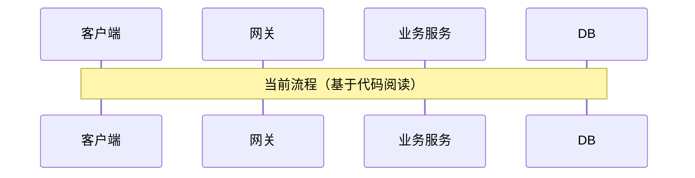
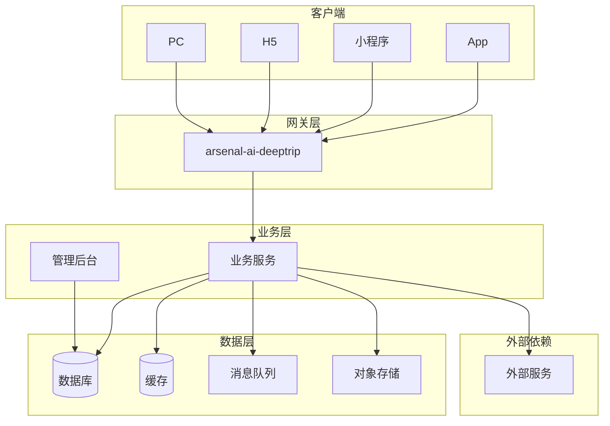
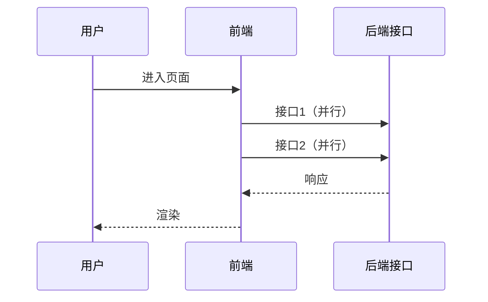
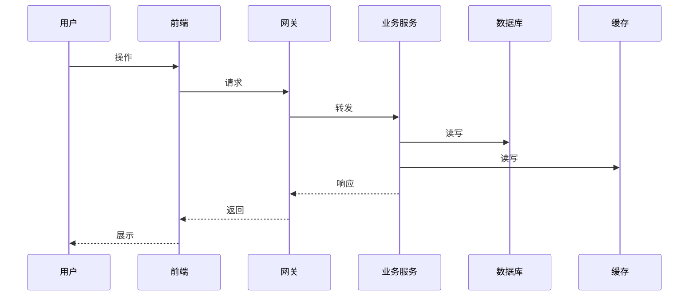

# {迭代主题} — 技术方案

- 创建时间：yyyy-MM-dd
- 基于：需求拆解_DOC.md
- 状态：{草稿 / 评审中 / 已定稿}

[TOC]

## 一、方案概述

> 一句话说清楚技术方案的核心思路。

- 需求来源：{需求拆解文档链接}
- 核心目标：
- 约束条件：

## 二、现有系统分析（先读代码再设计）

> **先搞清楚现在的代码怎么跑的，再设计新方案。不读代码就设计等于空中楼阁。**

### 2.1 现有流程图

> 读完代码后画出当前的调用链路，标注关键类/方法/接口。



### 2.2 现有代码关键路径

| 应用 | 关键类/文件 | 关键方法 | 职责 | 备注 |
|------|-----------|---------|------|------|
| | | | | {历史逻辑/技术债/需注意的坑} |

### 2.3 历史逻辑与技术债

> 现有代码中发现的问题，会影响新方案设计的部分。

| 问题 | 影响 | 本次是否处理 | 处理方式 |
|------|------|-------------|---------|
| | | 是 / 留后续 | |

## 三、整体流程设计

> **最重要的一张图**：从客户端发起到数据落地，全链路都要画清楚。

### 3.1 整体流程图



### 3.2 涉及的应用/模块

| 应用/模块 | 职责 | 变更类型 | 责任人 |
|-----------|------|----------|--------|
| | | 新增/修改/不变 | |

### 3.3 网络与调用关系

| 调用方 | 被调方 | 协议 | 说明 |
|--------|--------|------|------|
| | | HTTP/RPC/MQ/WebSocket | |

## 四、客户端调用设计

> 客户端怎么调、调哪些接口、版本怎么管，前端和服务端必须对齐。

### 4.1 各端支持情况

| 客户端 | 是否支持 | 差异说明 | 责任人 |
|--------|---------|---------|--------|
| App（tc_app） | 是 / 否 | | |
| 微信小程序（tcwxminiapp） | 是 / 否 | | |
| H5 | 是 / 否 | | |
| PC | 是 / 否 | | |
| 其他渠道 | 是 / 否 | | |

### 4.2 接口版本管理

| 接口 | 当前版本 | 本次变更 | 兼容策略 |
|------|---------|---------|---------|
| | v1 | 新增 v2 / 修改 v1 | 老版本保留多久 / 强制升级 |

### 4.3 前端调用时序

> 前端页面加载后，按什么顺序调接口？并行还是串行？loading 怎么处理？



## 五、场景级技术方案

> **每个最小场景都要有流程图 + 完整技术细节。**

### 场景 1：{场景名称}

#### 场景流程图



#### 接口清单

| 接口 | 方法 | 所属应用 | 说明 | 新增/修改 | 责任人 |
|------|------|----------|------|----------|--------|
| `/api/xxx` | POST | | | | |

#### 接口详情

**POST /api/xxx**

- 用途：
- 版本：{v1 / v2}
- 请求体：

```json
{
  "field": "说明"
}
```

- 响应体：

```json
{
  "code": 0,
  "data": {}
}
```

- 错误码：

| code | 含义 | 客户端处理建议 |
|------|------|--------------|
| | | |

- 幂等：{是否需要 / 幂等键}

#### 接口测试用例

> 每个接口必须定义测试用例，作为测试阶段的输入。

| 用例ID | 参数 | 期望状态码 | 期望响应 | 备注 |
|--------|------|-----------|---------|------|
| API-001 | {正常参数} | 200 | {正常响应} | Happy Path |
| API-002 | {参数缺失} | 400 | {错误信息} | 参数校验 |
| API-003 | {非法参数} | 400 | {错误信息} | 参数校验 |
| API-004 | {边界值} | 200/400 | | 边界测试 |
| API-005 | {无权限} | 403 | | 权限测试 |

#### 表设计

| 表名 | 操作 | 说明 |
|------|------|------|
| | 新增表/加字段/加索引/读/写 | |

**新增/变更字段：**

| 表名 | 字段 | 类型 | 说明 | 默认值 | 索引 |
|------|------|------|------|--------|------|
| | | | | | 是/否 |

> 遵循 `table-design` skill 规范。

#### 缓存设计

| 缓存 key | 数据内容 | 过期时间 | 更新策略 | 一致性保证 |
|-----------|---------|---------|---------|-----------|
| | | | 写时更新/定时刷新/失效重建 | |

#### 消息设计

| topic | 生产者 | 消费者 | 触发条件 | 消费失败处理 |
|-------|--------|--------|---------|-------------|
| | | | | 重试/死信/告警 |

#### 存储设计（文件/对象存储）

| 存储位置 | 内容 | 路径规则 | 访问方式 | 生命周期 |
|---------|------|---------|---------|---------|
| | | | | |

#### 配置中心

| 配置 key | 说明 | 默认值 | 是否支持动态修改 |
|----------|------|--------|----------------|
| | | | |

### 场景 2：{场景名称}

> 同上结构，按场景逐个展开...

## 六、开发后台管理

> 本次需求是否需要在开发管理平台增加页面/功能？

### 6.1 是否涉及

- [ ] 需要新增管理页面
- [ ] 需要新增/修改管理接口
- [ ] 需要数据查看/导出功能
- [ ] 需要运营配置功能（开关/排序/文案等）
- [ ] 不涉及

### 6.2 管理功能清单（如涉及）

| 功能 | 页面/菜单位置 | 操作说明 | 权限要求 | 责任人 |
|------|-------------|---------|---------|--------|
| | | | | |

## 七、外部依赖

| 外部系统/服务 | 调用方式 | 用途 | SLA | 挂了怎么办 | 联调联系人 |
|-------------|---------|------|-----|-----------|-----------|
| | HTTP/SDK/MQ | | | 降级/缓存兜底/报错 | |

## 八、初始化数据

> 上线前是否需要预置/初始化数据？

| 数据内容 | 目标表/存储 | 数据量 | 初始化方式 | 责任人 | 是否可重复执行 |
|---------|-----------|--------|-----------|--------|--------------|
| | | | SQL脚本/接口/手动 | | |

## 九、监控、告警与数据可视化

### 9.1 性能监控

| 监控项 | 指标 | 阈值 | 告警方式 |
|--------|------|------|---------|
| 接口响应时间 | P99 < {X}ms | | |
| 接口成功率 | > {X}% | | |
| QPS | < {X} | | |

### 9.2 限流与降级

| 接口/功能 | 限流策略 | 阈值 | 降级方案 |
|-----------|---------|------|---------|
| | 令牌桶/滑窗/固定窗口 | | {返回兜底数据/关闭功能/排队} |

### 9.3 关键告警

| 告警名称 | 触发条件 | 告警级别 | 通知渠道 | 处理人 |
|---------|---------|---------|---------|--------|
| | | P0/P1/P2 | 电话/短信/飞书/邮件 | |

### 9.4 业务数据可视化

> 产品/运营需要看什么业务数据？用什么平台看？

| 数据指标 | 说明 | 数据源 | 展示平台 | 更新频率 | 责任人 |
|---------|------|--------|---------|---------|--------|
| | | DB/日志/埋点 | Grafana/内部报表 | 实时/T+1 | |

### 9.5 系统运行数据可视化

| 指标 | 说明 | 展示平台 | 告警阈值 |
|------|------|---------|---------|
| 接口 QPS | | | |
| 错误率 | | | |
| 缓存命中率 | | | |
| 消息积压量 | | | |
| DB 慢查询 | | | |

## 十、埋点设计

| 事件名 | 触发时机 | 端（前端/后端） | 上报参数 | 用途 |
|--------|---------|---------------|---------|------|
| | | | | 流量统计/转化分析/行为分析 |

## 十一、并发与一致性设计

> 两个请求同时改同一条数据怎么办？缓存和DB不一致怎么办？不集中想清楚，上线必踩。

### 11.1 并发场景识别

| 场景 | 并发风险 | 影响 |
|------|---------|------|
| {同一用户重复提交} | | |
| {多用户操作同一资源} | | |
| {缓存与DB并发更新} | | |

### 11.2 一致性方案

| 场景 | 方案 | 具体实现 |
|------|------|---------|
| 防重复提交 | {幂等键 / 前端防抖 / 后端去重} | 幂等键：{字段}，存储：{Redis/DB} |
| 并发写同一资源 | {分布式锁 / 乐观锁(版本号) / 数据库行锁} | |
| 缓存与DB一致性 | {先更DB再删缓存 / 延迟双删 / binlog同步} | |
| 跨服务事务 | {本地事务 / 最终一致性(MQ) / TCC / Saga} | |

### 11.3 事务边界

| 操作 | 事务范围 | 失败处理 |
|------|---------|---------|
| | {同一事务 / 分开 / 异步补偿} | {回滚 / 重试 / 人工介入} |

## 十二、安全设计

> 对外暴露的接口、涉及用户数据的操作，集中过一遍安全。

### 12.1 认证与鉴权

| 接口/功能 | 认证方式 | 鉴权规则 | 未授权处理 |
|-----------|---------|---------|-----------|
| | Token/Session/签名 | {角色/权限/数据归属} | 返回 403 / 跳转登录 |

### 12.2 接口防护

| 防护项 | 方案 | 涉及接口 |
|--------|------|---------|
| 防刷/频控 | {IP限频 / 用户限频 / 验证码} | |
| 防重放 | {时间戳+nonce / 签名} | |
| 输入校验 | {参数类型/长度/格式/枚举白名单} | |
| SQL注入/XSS | {参数化查询 / 输出转义} | |

### 12.3 数据安全

| 数据类型 | 存储加密 | 传输加密 |
|---------|---------|---------|
| 手机号 | | |
| 身份证 | | |
| 密码/Token | | |
| 用户行为 | | |

### 12.4 敏感操作审计

| 操作 | 是否需要审计日志 | 记录内容 |
|------|----------------|---------|
| {删除数据} | 是 / 否 | {操作人/时间/操作内容/操作前后值} |
| {修改权限} | 是 / 否 | |
| {数据导出} | 是 / 否 | |

## 十三、日志与排障设计

> 上线后出问题第一时间看日志。不提前设计，出了事就是"瞎子排障"。

### 13.1 关键日志打点

| 打点位置 | 日志内容 | 日志级别 | 示例 |
|---------|---------|---------|------|
| 接口入口 | 请求参数 | INFO | `[接口名] 收到请求, userId={}, params={}` |
| 接口出口 | 响应结果 + 耗时 | INFO | `[接口名] 响应完成, userId={}, 耗时={}ms` |
| 外部调用前后 | 请求/响应 + 耗时 | INFO | `[调用xxx] 请求={}, 响应={}, 耗时={}ms` |
| 异常 | 完整异常栈 + 上下文 | ERROR | `[接口名] 处理失败, userId={}, error={}` |
| 关键业务节点 | 状态变化/计算结果 | INFO | `[业务] 状态变更: {} -> {}, 原因={}` |

### 13.2 traceId 传递

| 链路 | 传递方式 |
|------|---------|
| 客户端 → 网关 | HTTP Header: X-Trace-Id |
| 服务间调用 | |
| 异步消息 | MQ Header / 消息体 |

### 13.3 排障手册（上线后怎么查问题）

| 问题现象 | 第一步看什么 | 关键日志关键字 | 常见原因 |
|---------|------------|-------------|---------|
| 接口超时 | | | |
| 数据不一致 | | | |
| 功能不生效 | | | |

## 十四、测试策略

> 告诉测试同学：核心场景怎么测、需要什么测试数据、哪些需要压测。

### 14.0 测试用例来源

> **测试用例从哪来？不是测试自己想，是从上游文档里提取。**

| 测试类型 | 用例来源文档 | 具体章节 |
|---------|-------------|---------|
| 功能测试 | 需求拆解_DOC.md | 「测试用例清单」章节 |
| 接口测试 | 技术方案_DOC.md | 每个接口的「接口测试用例」表 |
| 单元测试 | 编码阶段产出 | 测试代码覆盖率 |

### 14.1 测试范围

| 场景 | 测试类型 | 优先级 | 说明 |
|------|---------|--------|------|
| | 接口测试/UI测试/集成测试 | P0/P1/P2 | |

### 14.2 测试数据

| 数据 | 来源 | 准备方式 | 责任人 |
|------|------|---------|--------|
| | 造数据/Mock | SQL脚本/接口/手动 | |

### 14.3 压测方案（如有性能要求）

- 是否需要压测：
- 压测场景：
- 压测目标：{QPS / 响应时间 / 错误率}
- 压测环境：
- 压测工具：
- 压测数据量：

### 14.4 自动化覆盖

| 范围 | 覆盖方式 | 现状 | 本次新增 |
|------|---------|------|---------|
| 核心接口 | 接口自动化 | | |
| 核心流程 | E2E 测试 | | |

## 十五、选型对比（多方案时填写）

| 维度 | 方案 A | 方案 B |
|------|--------|--------|
| 复杂度 | | |
| 性能 | | |
| 可维护性 | | |
| 开发时间 | | |
| 风险 | | |

**推荐方案**：方案 X，理由：

## 十六、数据迁移（如有）

- 是否需要迁移：
- 涉及的数据量：
- 迁移方案：
- 迁移脚本位置：
- 回滚方案：
- 迁移验证方式：
- 预计耗时：

## 十七、上线方案与回退

### 17.1 环境与资源申请

> 不提前申请，开发到一半卡住等资源。

| 资源 | 操作 | 申请渠道 | 负责人 | 状态 |
|------|------|---------|--------|------|
| 数据库（新建表/加字段） | | DBA 审批 | | 待申请/已完成 |
| 缓存实例 | | | | |
| MQ topic | | | | |
| 域名/证书 | | | | |
| 网络白名单 | | | | |
| 对象存储 bucket | | | | |
| 配置中心 namespace | | | | |
| 第三方服务账号/权限 | | | | |

### 17.2 上线步骤

| 顺序 | 操作 | 负责人 | 预计耗时 | 验证方式 |
|------|------|--------|---------|---------|
| 1 | {数据库变更} | | | |
| 2 | {配置变更} | | | |
| 3 | {后端发布} | | | |
| 4 | {前端发布} | | | |
| 5 | {数据初始化} | | | |
| 6 | {灰度验证} | | | |
| 7 | {全量放开} | | | |

### 17.3 灰度策略

- 灰度维度：{用户/渠道/比例/白名单}
- 灰度范围：
- 观察时间：
- 全量条件：

### 17.4 回退方案

| 故障场景 | 回退操作 | 数据处理 | 预计恢复时间 | 负责人 |
|---------|---------|---------|-------------|--------|
| 接口异常 | | | | |
| 数据错误 | | | | |
| 性能问题 | | | | |

### 17.5 上线风险

| 风险 | 影响 | 概率 | 预防措施 | 应急方案 |
|------|------|------|---------|---------|
| | | 高/中/低 | | |

## 十八、待确认项

| 编号 | 问题 | 需要谁确认 | 截止时间 | 确认结果 |
|------|------|-----------|---------|---------|
| | | | | |

## 十九、影响范围总览

| 维度 | 涉及内容 |
|------|----------|
| 应用 | |
| 接口（新增） | |
| 接口（变更） | |
| 数据库表 | |
| 缓存 | |
| 消息队列 | |
| 配置中心 | |
| 对象存储 | |
| 外部依赖 | |
| 开发后台 | |
| 埋点 | |
| 监控/告警 | |
| 数据可视化 | |
| 并发/锁/事务 | |
| 安全（鉴权/防刷） | |
| 日志打点 | |
| 测试（压测/自动化） | |
| 环境/资源申请 | |
| 联调方 | |
| 客户端（App/小程序/H5/PC） | |
