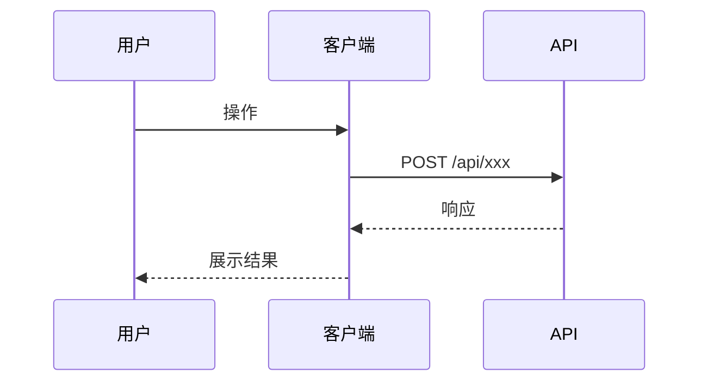

# {迭代主题} — 接口清单

- 创建时间：yyyy-MM-dd
- 状态：{草稿 / 评审中 / 已定稿}

[TOC]

## 一、接口总览

| 接口 | 方法 | 所属应用 | 用途 | 新增/修改 | 责任人 |
|------|------|----------|------|----------|--------|
| /api/xxx | POST | | | | |
| /api/xxx/{id} | GET | | | | |
| /api/xxx/{id} | PUT | | | | |
| /api/xxx/{id} | DELETE | | | | |

## 二、接口详情

### POST /api/xxx

#### 基本信息

| 项目 | 内容 |
|------|------|
| 接口路径 | POST /api/xxx |
| 所属应用 | |
| 用途 | |
| 版本 | v1 |
| 新增/修改 | 新增 |
| 责任人 | |

#### 请求参数

**Headers:**

| 参数名 | 类型 | 必填 | 说明 |
|--------|------|------|------|
| Authorization | String | 是 | Bearer Token |
| Content-Type | String | 是 | application/json |

**Path Parameters:**

| 参数名 | 类型 | 必填 | 说明 |
|--------|------|------|------|
| | | | |

**Query Parameters:**

| 参数名 | 类型 | 必填 | 说明 | 示例 |
|--------|------|------|------|------|
| | | | | |

**Request Body:**

```json
{
  "field1": "说明",
  "field2": {
    "nestedField": "说明"
  },
  "field3": ["说明"]
}
```

| 字段 | 类型 | 必填 | 说明 | 校验规则 |
|------|------|------|------|---------|
| field1 | String | 是 | | 长度 1-100 |
| field2 | Object | 否 | | |
| field2.nestedField | String | 是 | | 枚举: A/B/C |

#### 响应参数

**Response Body:**

```json
{
  "code": 0,
  "message": "success",
  "data": {
    "id": "说明",
    "name": "说明"
  }
}
```

| 字段 | 类型 | 说明 |
|------|------|------|
| code | Integer | 状态码，0 表示成功 |
| message | String | 状态信息 |
| data | Object | 业务数据 |
| data.id | String | |
| data.name | String | |

#### 错误码

| code | 含义 | 客户端处理建议 |
|------|------|--------------|
| 0 | 成功 | 正常处理 |
| 400 | 参数错误 | 提示用户检查输入 |
| 401 | 未登录 | 跳转登录页 |
| 403 | 无权限 | 提示无权限 |
| 500 | 服务器错误 | 提示稍后重试 |

#### 接口特性

| 特性 | 说明 |
|------|------|
| 幂等 | 是/否，幂等键：xxx |
| 缓存 | 是/否，缓存策略：xxx |
| 限流 | 是/否，限流规则：xxx |

#### 调用示例

**curl:**

```bash
curl -X POST 'https://api.example.com/api/xxx' \
  -H 'Authorization: Bearer {token}' \
  -H 'Content-Type: application/json' \
  -d '{
    "field1": "value1"
  }'
```

---

### GET /api/xxx/{id}

#### 基本信息

| 项目 | 内容 |
|------|------|
| 接口路径 | GET /api/xxx/{id} |
| 所属应用 | |
| 用途 | |
| 版本 | v1 |
| 新增/修改 | 新增 |
| 责任人 | |

#### 请求参数

**Path Parameters:**

| 参数名 | 类型 | 必填 | 说明 |
|--------|------|------|------|
| id | String | 是 | 资源ID |

**Query Parameters:**

| 参数名 | 类型 | 必填 | 说明 | 示例 |
|--------|------|------|------|------|
| fields | String | 否 | 返回字段 | id,name |

#### 响应参数

```json
{
  "code": 0,
  "message": "success",
  "data": {
    "id": "123",
    "name": "示例"
  }
}
```

#### 调用示例

```bash
curl -X GET 'https://api.example.com/api/xxx/123' \
  -H 'Authorization: Bearer {token}'
```

---

## 三、接口测试用例

### POST /api/xxx 测试用例

| 用例ID | 场景 | 请求参数 | 期望状态码 | 期望响应 | 备注 |
|--------|------|---------|-----------|---------|------|
| API-001 | 正常创建 | {正常参数} | 200 | {成功响应} | Happy Path |
| API-002 | 缺少必填字段 | {缺少 field1} | 400 | {错误信息} | 参数校验 |
| API-003 | 字段格式错误 | {field1: 123} | 400 | {错误信息} | 类型校验 |
| API-004 | 未登录 | 无 Token | 401 | {错误信息} | 鉴权 |
| API-005 | 无权限 | 普通用户 Token | 403 | {错误信息} | 鉴权 |

## 四、客户端调用说明

### 4.1 各端调用时序



### 4.2 前端调用示例

```javascript
// JavaScript/TypeScript
async function callApi(params) {
  const response = await fetch('/api/xxx', {
    method: 'POST',
    headers: {
      'Authorization': `Bearer ${token}`,
      'Content-Type': 'application/json'
    },
    body: JSON.stringify(params)
  });
  return response.json();
}
```

## 五、接口版本管理

| 接口 | 当前版本 | 本次变更 | 兼容策略 |
|------|---------|---------|---------|
| /api/xxx | v1 | 新增 v2 | v1 保留 3 个月 |
